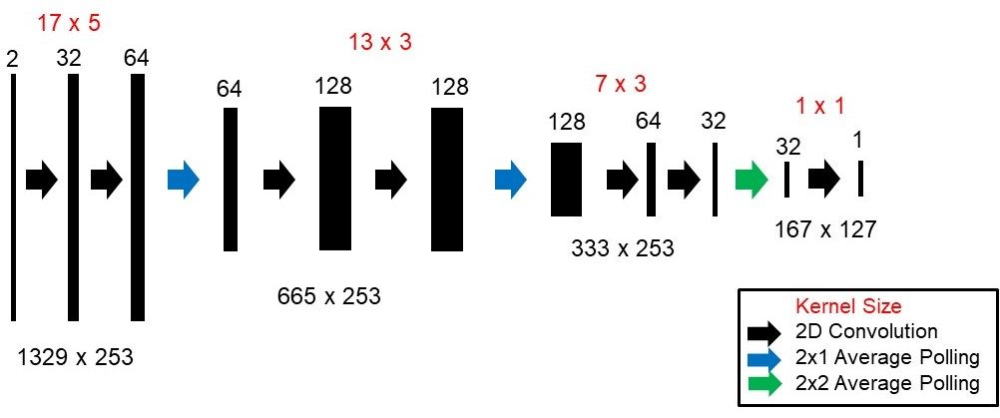
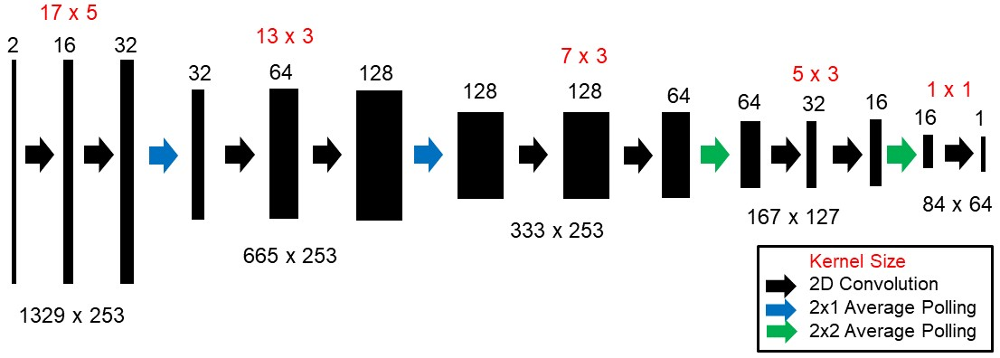

# DT-Net
Convolutional Neural Networks have proved to be a vital tool for displacement estimation. A lot of work is being done in the domain of optical flow estimation using RGB images. Similarly progress is being made in the field of displacement estimation using RF images. RF data is important to detect pathologies in tissues due to varying biomechanical properties. Also RF signal, which has different frequency distribution than normal computer vision images, contains phase information as well, making it a different problem in displacement estimation as conventional CNN fail to extract relevant information from RF data. This issue of displacement estimation using RF images is addressed in this work. An attempt to estimate displacement in an unsupervised fashion is made for which Local Correlation Coefficient (LCC) loss function is defined. A supervised training approach is also evaluated. The method is also viewed as a potential to replace normalized cross-correlation which is currently used in the displacement estimation step for speed-of-sound (SoS) imaging.

## Requirements
Execute the following command to install dependencies.
```bash
pip install -r requirements.txt
```

## Dataset 
The network is trained and evaluated on a private dataset of beamformed RF frames. RF data from 6 channel pairs is available in the dataset. Pseudo ground truth displacements for each channel pair are available which are used in supervised training.

## Model
2 versions of DT-Net are available 
- DT-NetE (for unsupervised training) defined in `model_new.py`
<p align="center">
  
</p>

- DT-NetS (for supervised training) defined in `model_new_super.py`
<p align="center">
  
</p>

## Training Approaches

- `train_new.py` is unsupervised training with anisotropic LCC loss using middle channel.
- `train_super.py` is supervised training using all 6 channels.

The `norm_para.py` script was used for finding the normalization parameters of the dataset.

## Testing 

- `test_new.py` is used for testing results using LCC loss (unsupervised).
- `test_super.py` is used for supervised model (using pseudo displacement fields)
